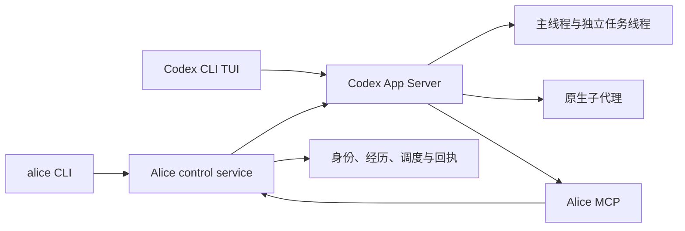

# Alice on Codex CLI

Alice 是基于 Codex CLI / App Server 公开接口的持续智能体扩展。Codex 提供模型调用、工具执行、原生线程、子代理、Goal 和上下文压缩；Alice 管理身份与经历、持久任务、运行状态及候选发布。Alice 不修改 Codex 核心，也不另建模型循环。

当前是待集成的源码候选，运行环境的最终切换尚未完成。GitHub 已建立 [四项验收任务](https://github.com/agent-alice/agent-alice/issues)，协作规范 [PR #5](https://github.com/agent-alice/agent-alice/pull/5) 已合入。下列命令用于包含完整扩展源码的检出目录；组件通过不能替代安装产物、真实学习或生产切换验收。

## 架构与支持范围



`alice chat` 连接同一个 App Server，并恢复主线程或指定任务线程。工作线程复用 Codex 的上下文管理；Alice 的长期经历保存在独立档案中，不把旧 JSONL 伪装为 native rollout。Codex 自动 memories 当前默认关闭。

本地服务使用 Unix sockets、`fcntl` 和进程组，支持范围是 **macOS / Linux**。macOS 有 launchd 接入，Linux 可将 `alice serve` 接入 supervisor。Windows 服务支持和 Alice GUI 均未实现；GUI 不是 CLI 运行前置。

## 安装与初始化

要求 Python 3.11+ 和兼容的 Codex CLI。当前原生集成基线为 `codex-cli 0.153.4`，其他版本需要重新验证公开接口。

```sh
python3 -m venv .venv
source .venv/bin/activate
python -m pip install -c requirements.lock -e '.[dev]'

export ALICE_HOME="$HOME/.local/share/alice-dev"
ALICE_CODEX="$(command -v codex)"
alice init --codex "$ALICE_CODEX" --model gpt-6-astra
alice doctor
```

如果 Codex 不在 PATH 中，将 `ALICE_CODEX` 设为已安装二进制的路径。初始化默认复制并记录二进制 hash，建立独立 `ALICE_HOME/codex`、工作区和数据目录。新实例的自治处于暂停状态，四个默认分层整理任务禁用；身份正文不会被编造。

使用原生 Codex 为这份独立 `CODEX_HOME` 登录，或初始化时明确增加 `--login-home "$HOME/.codex"` 来链接已有文件式登录。后一种方式共享登录文件，其他配置和运行数据仍隔离。凭据、身份和原始日志保存在 Git 仓库之外。

运行设置位于 `$ALICE_HOME/config.json`。停止服务后修改设置，再运行 `doctor` 和 `start`。启动时合并生成的模型、沙箱、features 与自有 MCP 设置，保留其他 MCP、plugins、未知配置和注释；损坏或并发修改的 TOML 会明确失败。自有 MCP 设置为 enabled／required，默认按工具清单批准调用，`autonomy_resume` 不在无人值守批准清单中。

## 交互、暂停与恢复

```sh
alice start
alice status
alice chat
alice ask "检查当前任务，报告证据和缺口" --wait 60
alice ask "完成指定的独立研究任务" --target research --request-id research-001
alice task-status --target research
alice intents
```

`--wait` 只限制等待结果的时间，超时不会取消任务。重试应保留相同 request ID；状态未知时先对账。原生子代理用于短子任务，命名任务线程保留各自的上下文与状态。

```sh
alice pause
alice resume
alice pause --target research
alice resume --target research
alice stop
alice start
```

全局暂停和目标暂停会持久保存，心跳与重启不能自行解除。`resume` 是显式恢复操作；关闭终端不等于停止服务。原生客户端的 `turn/interrupt` 已在真实 Codex 二进制的受控集成测试中验证可转为持久暂停，并在重启后保留。

## 持久调度

```sh
alice cron list
alice cron create --name review --every 7200 --target review \
  --prompt "检查已有承诺；没有新证据时等待" --disabled
alice cron enable JOB_ID
alice cron disable JOB_ID
alice cron delete JOB_ID
```

也可用 `--cron` 或 `--at` 代替 `--every`，并用 `--timezone` 明确时区。`--heartbeat` 创建审视任务，`--catch-up` 启用补做。启用任务与解除全局自治暂停是不同操作。

默认分层整理为两小时、日、周、月四层。补做会覆盖派发范围内全部已关闭期间；空来源可记录为跳过，坏来源会报错。下层摘要真实提交后才能证明上层输入就绪，不能仅凭时钟到了就声称整理完成。

## 身份、记忆与来源

SOUL、USER、MEMORY、手记及经历档案保存在运行工作区，来源索引和不可变归档保存在私有数据目录。旧框架的执行规则不会随原文归档自动激活。

```sh
alice stop
alice memory snapshot /path/to/legacy-workspace \
  --external runtime-logs=/path/to/runtime-logs
alice memory search "需要查询的经历"
alice memory read SOURCE_ID --offset 0 --max-chars 4096
alice memory prepare L1 2026-01-01T00:00
alice memory commit BATCH_ID /path/to/candidate.json
```

快照支持 `--previous SNAPSHOT_ID` 和 `--final`。最终快照需要控制流程先确认旧 writer 停写；参数本身不会停止旧系统。切换和回退须保留新产生的记录，不能将旧快照覆盖回新工作区。

检索返回来源元数据；索引只保存有界预览，无匹配不证明原文不存在。读取可分页访问完整记录。摘要 prepare 冻结来源并生成任务 prompt，由 Codex 阅读后形成候选；commit 校验来源版本、引用和覆盖并保留旧手记。结构校验不等于事实正确性或已学会。

旧调度可先导出为私有审查计划，再在目的服务停止时导入：

```sh
alice legacy export /path/to/legacy-workspace --output "$ALICE_HOME/legacy-review.json"
alice legacy import "$ALICE_HOME/legacy-review.json"
```

首次导入的候选默认禁用，旧渠道元数据不代表新的发送授权；未适配的 collector 或旧框架命令不会因此自动运行。

## 采集与结果检查

已实现有界的只读 HTTP collection 采集器。它支持 `data` 与 `paging.is_end/next` 的分页结构，检查页数、条目数、缺失字段及独立观察差异；当前默认指标为 `voteup_count` 和 `comment_count`。它不是任意网站适配器，也不保证未知生产接口、认证或发布链路可用。

将以下占位 URL 替换为明确允许读取且符合格式的 endpoint。URL 是第一个**位置参数**，没有 `--url` 选项。

```sh
alice collect "https://example.invalid/api/items" \
  --subject demo-account --collection answers \
  --max-pages 10 --max-items 100 \
  --output "$ALICE_HOME/observations/items.json"
alice check-draft /path/to/draft.md
alice summarize-observation /path/to/observation-v1.json
```

认证请求头可通过 `--header-env HEADER=ENV_NAME` 引用已设置的环境变量，命令不接受凭据正文。`--expected-count` 和 `--independent` 可补充覆盖与独立对账证据。采集失败、截断和覆盖不足保留为不完整状态，不当作空集合成功。

`check-draft` 检查草稿；`summarize-observation` 接受纯 observation schema 文档。`collect` 输出含 observation、summary、fetches 的封装，可直接交给下面的资源记录命令。检查不通过或采集不完整返回退出码 2；运行错误返回 1。采集器不会发布内容。

## 资源与账目

```sh
alice resources status
alice resources refresh
alice resources observation "$ALICE_HOME/observations/items.json" \
  --receipt-id observation-001 --period 2026-01-01
alice resources money --receipt-id cost-001 --kind cost \
  --amount-microusd 1000000 --source external-receipt
```

`refresh` 要求服务运行，用于读取原生账户额度；其余命令可操作本地账本。observation 与 money 使用稳定 receipt ID 去重，重复 ID 对应不同证据会报冲突。money 只记录已有收入或成本凭证，`--kind` 支持 income／cost，金额单位是百万分之一美元；它不执行付款。

原生累计 token 是线程用量观察，**不是账单**，不会自行换算为美元成本。账户额度、显式金额凭证和虚拟预算分别保存。虚拟预算默认禁用，只有明确规则和期初余额配置后才可启用；当前 CLI 没有预算启用命令。刷新额度不会解除人工暂停，也不能用虚拟收入替代账户真实额度。

## 测试与候选发布

从源码运行相应测试，使用隔离数据和自己创建的进程：

```sh
python -m pytest tests -m 'not native and not live and not artifact' -q
ALICE_TEST_CODEX_BINARY="$ALICE_CODEX" \
  python -m pytest tests/test_native_service.py -m 'native and not live' -q
python tools/check.py --source . --codex-binary "$ALICE_CODEX" --native \
  --report "$ALICE_HOME/checks/candidate.json"
```

`tools/check.py` 构建并验证候选，安装产物测试调用独立环境中的真实入口；`--native` 要求显式 Codex 二进制。真实模型测试是单独的 live 范围，需要授权、配置和预算。缺失、跳过、失败、超时或空测试集不能算作必需门槛通过。

```sh
alice release build .
alice release verify CANDIDATE_ID --native
alice stop
alice release activate CANDIDATE_ID
alice start
alice release current

alice stop
alice release rollback
alice start
```

只激活同一受检产物。报告绑定源码、依赖、二进制及产物 hash，源码变化需重新验证。回退切换兼容代码版本，保留新增运行数据。

macOS 在已有受检且激活的 release 后可使用 `alice service install`、`alice service status`、`alice service uninstall`；Linux 可使用 `alice serve`。部署入口存在不代表所有平台上的服务安装和恢复均已验收。

## 当前待验范围

- 源码和 CI 工作流随候选提供；远端结果及必需检查配置需要分别核对，规范本身不提供运行能力证据。
- 当前改动后的完整 release gate、安装产物和部署／回退链路需绑定实际候选验证。
- 原始日志完整保存、运行环境最终切换及切换后的唯一派发者验收尚未完成。
- 本机一次真实模型评测已通过指定合成用例：一次纠正后，三个新会话变体的实际 JSON 结果正确，并确认执行了保存的脚本。技能目录的写入权限已按原生 profile 接通；评测未加入默认 CI，此结果不代表通用学习或实际业务能力。
- 真实业务认证、外部结果对账与发布流程需要各自验收；有界 collector 不代表完整业务能力。

协作与验收要求见 [开发规范](specs/development.md)。
